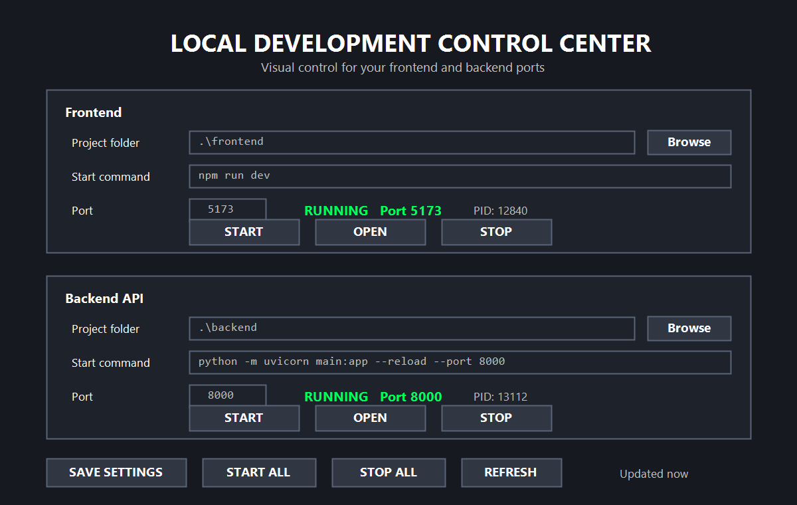

# Local App Control Center

Windows desktop control panel for starting, stopping, opening, and monitoring local frontend and backend development servers.



## What's New in v1.2

- START changes the service status immediately to bright green while the server starts.
- The UI no longer flashes back to STOPPED while npm, Vite, or Node is still starting.
- Port status refreshes every 500 ms.
- Once the configured port is listening, the real listener PID is shown and OPEN becomes available.
- npm and npx project-root detection moves a selected child folder to the nearest parent folder containing `package.json`.
- STOP keeps the process-tree shutdown fix using `taskkill /T /F`.

## Features

- Separate Frontend and Backend API panels.
- Configurable project folder, start command, and port per service.
- START, STOP, OPEN, START ALL, STOP ALL, REFRESH, and SAVE SETTINGS controls.
- Automatic settings persistence in a local `controlcenter.ini` file beside the executable.
- Build script for Windows using the .NET Framework C# compiler.

## Build

1. Clone or download this repository.
2. On Windows, double-click `BUILD_EXE.bat`.
3. Run the generated `LocalAppControlCenter.exe`.

You can also run the PowerShell build script directly:

```powershell
powershell.exe -NoProfile -ExecutionPolicy Bypass -File .\build_windows_exe.ps1
```

## Upgrade Notes

Existing `controlcenter.ini` files can stay beside the new executable. The settings format is unchanged.

For npm commands, the selected project folder should be the folder containing `package.json`. Version 1.2 can detect and correct a nearby parent project root automatically.

[](https://doi.org/10.5281/zenodo.22976310)
